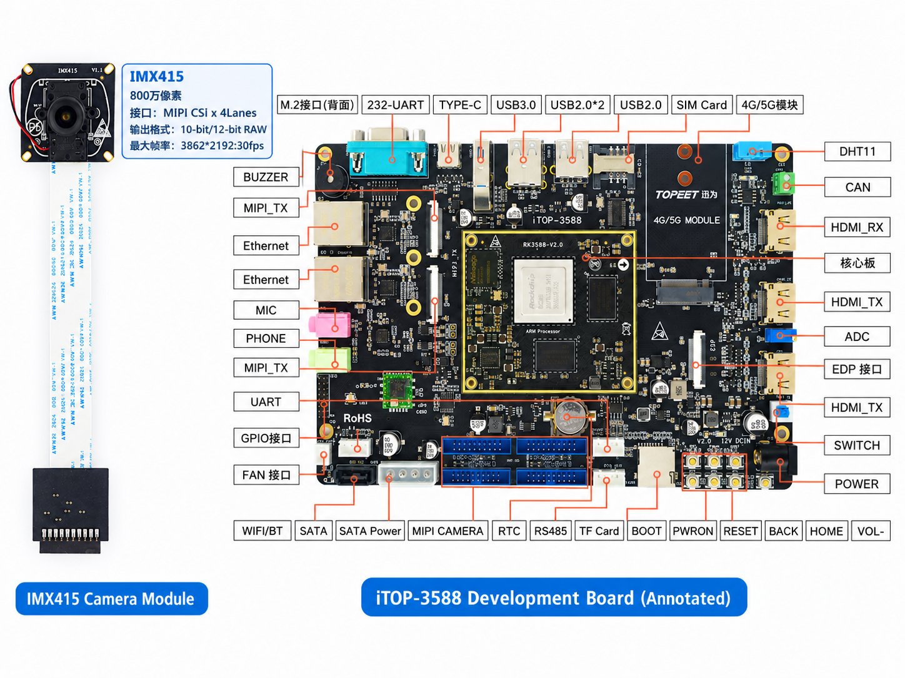
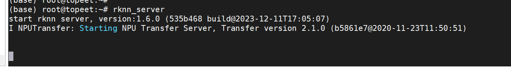
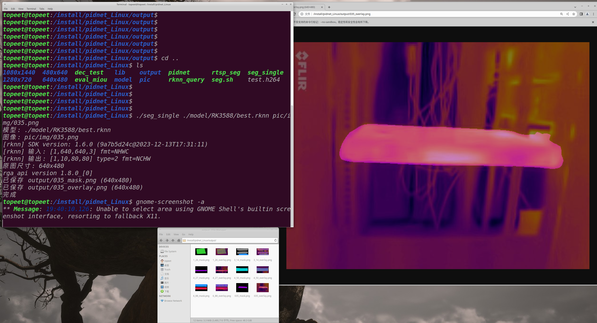
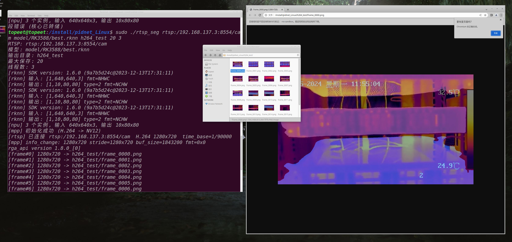
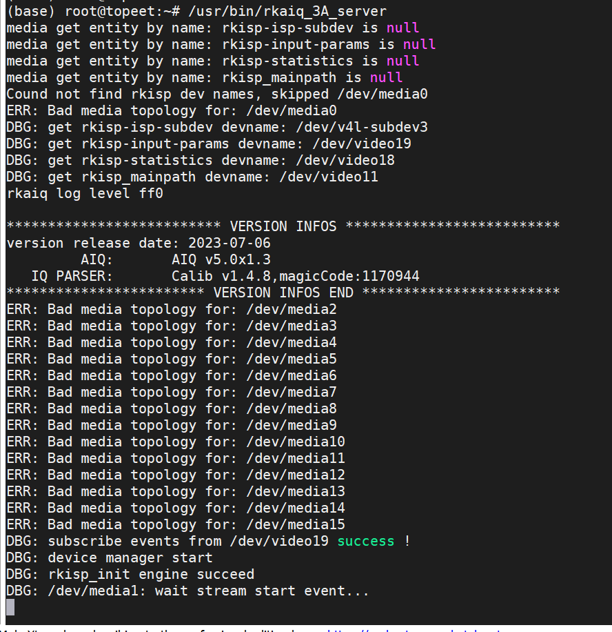
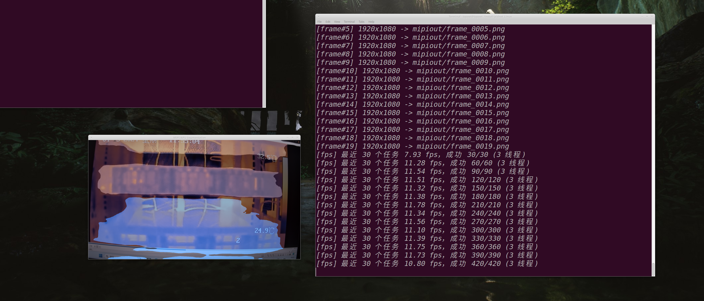

# i.RK3588_ir_seg
## 1. Overview
基于 RK3588 红外发热检测系统设计。将模型部署至RK3588开发板中，通过MIPI或网络摄像头，调用RGA和MPP API函数对红外图像或视频流进行Resize和硬解码，再通过NPU进行语义分割，最后输出叠加图和分割mask。
项目包含：

## 2. 🎬 视频演示
https://github.com/user-attachments/assets/cdb546ab-9491-4c9a-99da-e0ddf1c6b1f9

## 3. 🖥️ 开发环境
<div align="center">
  
</div>

| 参数 | Value |
| --- | --- |
| CPU | RK3588 |
| 主频 | 四核 Cortex-A55, Quad-core ARM Cortex-A76,Neon and FPU， 2.4GHz |
| 内存 | 4GB |
| 存储介质 | 32GB EMMC |
| GPU | ARM Mali-G610 MP4,OpenGL ES1.1/2.0/3.2, Vulkan 1.2, OpenCL 2.2 |
| NPU | 支持 6T 算力 |
| 系统 | Ubuntu 20.04 |
| 内核版本 | 5.10.198 |

- 虚拟机版本：`20.04.6 LTS`
- 交叉编译器：`gcc-arm-10.3-2021.07-x86_64-aarch64-none-linux-gnu`
- 工具：Miniconda、Python 3.8、RKNN-Toolkit2-1.6、RKNN-Toolkit-Lite2-1.6、RKNPU2

## 4. 📁 仓库目录说明
```text
rk3588-linux/
├── README.md                          # 项目说明
├── pic/                               # README 配图
├── rk_ir_seg/                         # 红外图像分割模型转换与量化
│   ├── data/                          # ONNX 模型与量化数据集配置
│   ├── output/                        # 不同量化方式的输出结果
│   └── tools/                         # 模型转换、评测与性能分析脚本
├── RKNPU_SDK/                         # RK3588 端侧推理应用
│   ├── include/                       # RKNN、RGA、MPP 等头文件与依赖
│   ├── model/RK3588/                  # rknn文件
│   ├── src/                           # 图像/视频流分割与评测源码
│   ├── CMakeLists.txt                 # CMake 构建配置
│   └── build-linux_RK3588.sh          # RK3588 交叉编译脚本
└── kernel/                            # RK3588 Linux 内核源码
```

## 5. 项目描述
1. 开发板开启rknn_serve服务
<div align="center">
  
</div>

2. 导出rknn，进行混合量化[说明文档](rk_ir_seg/README.md)
```bash
cd rk_ir_seg/tools
python tools/accuracy_analysis.py      # 量化精度分析，需要连接开发板
python tools/step1.py                  # 量化step1,生成cfg文件
python tools/step2.py                  # 量化step2,导出best.rknn，需要连接开发板
python tools/eval_perf.py              # 评估性能
python tools/eval_mem.py               # 评估内存
python tools/eval_summary.py           # 推算大致的fps
```

3. 通过NPU进行语义分割，输出叠加图和分割mask[说明文档](RKNPU_SDK/README.md)
- 构建[CMake工程](RKNPU_SDK/CMakeLists.txt)
把整个 install/pidnet_Linux/ 目录拷到 RK3588 板子的根目录：
```bash
cd RKNPU_SDK/
./build-linux_RK3588.sh                # 重新编译
adb push install /                     # 拷贝到开发板的根目录
adb push ./pic /install/pidnet_Linux   # 拷贝测试的图片
# 进入开发板
cd /install/pidnet_Linux
./seg_single ./model/RK3588/best.rknn pic/img/xxx.png    # 查看单张图片的预测叠加图
```
<div align="center">
  
</div>

4. RTSP 拉流 -> MPP 硬解 -> RGA -> NPU 推理 (rtsp_seg)
> FFmpeg 拉 RTSP -> 剥离协议容器得 H.264 包 -> MPP 硬解出 NV12 -> RGA 缩放转 RGB640x640 -> NPU 语义分割 -> 保存叠加图。
```bash
# 打开虚拟机
# 1. 将图片转为h264流
ffmpeg -y -framerate 25 -pattern_type glob -i 'h264_out/by_res/1280x720/*.png' \
  -c:v libx264 -profile:v high -level 4.0 \
  -pix_fmt yuv420p -bf 0 -g 25 -x264-params "annexb=1" \
  -an -f h264 h264_out/1280x720.h264

# 2. 裸流 → MP4
ffmpeg -y -framerate 25 -i h264_out/1280x720.h264 -c copy h264_out/1280x720.mp4

# 3. 另开终端，在虚拟机上开启流媒体服务器，接收ffmpeg推流，并提供rtsp拉流服务
cd /home/topeet/rk3588-linux/rk_ir_seg/tools/mediamtx
./mediamtx ./mediamtx.yml

# 4. ffmpeg循环推流
cd /home/topeet/rk3588-linux/rk_ir_seg
ffmpeg -re -stream_loop -1 -i h264_out/1280x720.mp4 \
  -c copy -f rtsp -rtsp_transport tcp rtsp://127.0.0.1:8554/cam

# 5. 进入开发板(拉流地址指向 PC 的 MediaMTX)
# (虚拟机先启动推流; 板子IP 192.168.137.10, 虚拟机IP 192.168.137.3)
cd /install/pidnet_Linux
sudo ./rtsp_seg rtsp://192.168.137.3:8554/cam model/RK3588/best.rknn h264_test 20 3  # 使用3线程(最多6线程)推理出20张图片在 h264_test/下
```
<div align="center">
  
  
</div>

5. 通过mipi摄像头进行预测
先在开发板中运行rkaiq_3A_server
<div align="center">
  
</div>

另开终端，运行mipi_seg，进行预测
```bash
# 使用3线程(最多6线程)推理出20张图片在 mipi_output/下
./mipi_seg /dev/video11 model/RK3588/best.rknn mipi_output 20 3
```
<div align="center">
  
</div>

## 6. sensor 数据通路(pipeline)
```text
Sensor ──► MIPI DPHY/DCPHY ──► mipiN_csi2 ──► rkcif_mipi_lvdsN ──► rkcif_..._sditf ──► rkispN_vir0 ──► (rkispp)
```
### ⚙️ 驱动源码路径
1. [Sensor 驱动](kernel/drivers/media/i2c/imx415.c)
2. [DTS 连接关系](kernel/arch/arm64/boot/dts/rockchip/topeet-camera-config.dtsi)
   phy、csi设备树:只看 csi2_dphy3、mipi4_csi2、rkcif_mipi_lvds、rkisp0_vir0 这几个节点的 compatible 和 reg，知道每级对应哪个驱动.[phy](kernel/arch/arm64/boot/dts/rockchip/rk3588s.dtsi)
3. MIPI D-PHY（物理层）:
   1. [DPHY 框架层](kernel/drivers/phy/rockchip/phy-rockchip-csi2-dphy.c)
   2. [硬件寄存器操作](kernel/drivers/phy/rockchip/phy-rockchip-csi2-dphy-hw.c)
   3. [公共结构体](kernel/drivers/phy/rockchip/phy-rockchip-csi2-dphy-common.h)
4. CSI2 接收:
   1. [CSI2 一个文件注册了两个驱动(逻辑层和硬件层)](kernel/drivers/media/platform/rockchip/cif/mipi-csi2.c)
   2. [结构体 csi2_device](kernel/drivers/media/platform/rockchip/cif/mipi-csi2.h)
5. RKCIF 捕获（DMA 入 DDR）:
   1. [CIF 平台驱动入口、media device 注册](kernel/drivers/media/platform/rockchip/cif/dev.c)
   2. [配置 CIF 输入格式、DMA 地址、帧中断](kernel/drivers/media/platform/rockchip/cif/hw.c)
   3. [视频捕获节点、vb2_ops、start_streaming、中断处理](kernel/drivers/media/platform/rockchip/cif/capture.c)
   4. [SDITF：CIF → ISP 的同步接口](kernel/drivers/media/platform/rockchip/cif/subdev-itf.c)

